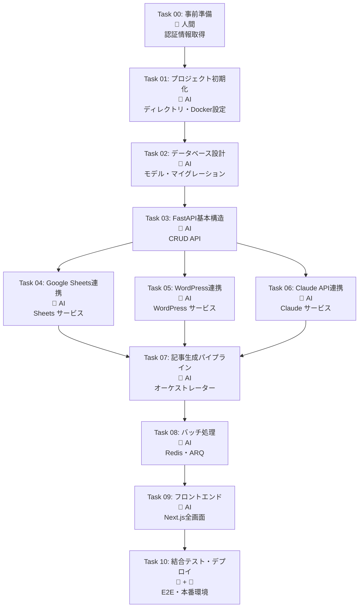

# タスク依存関係ガイド - AI Agent向け

このドキュメントは、記事自動生成システムの実装タスクにおける依存関係を明確にし、AI Agentが効率的にタスクを実行できるようにするためのガイドです。

---

## 📊 タスク依存関係マップ



---

## 🔄 タスク実行順序と依存関係

### レベル 0: 事前準備

| タスク | 担当 | 依存関係 | 並列実行 |
|--------|------|----------|----------|
| Task 00 | 👤 人間 | なし | N/A |

**重要:** タスク00は人間が手作業で実施する必要があります。AI Agentはタスク00の完了を前提として次のタスクに進んでください。

---

### レベル 1: 基盤構築

| タスク | 担当 | 依存関係 | 並列実行 |
|--------|------|----------|----------|
| Task 01 | 🤖 AI | Task 00 | 不可 |

**実行順序:** Task 00 → Task 01

**AI Agent への指示:**
- Task 00が完了していることを確認してから開始
- `.env.example` ファイルが存在することを確認
- プロジェクト構造を作成し、Docker環境を構築

---

### レベル 2: データベース層

| タスク | 担当 | 依存関係 | 並列実行 |
|--------|------|----------|----------|
| Task 02 | 🤖 AI | Task 01 | 不可 |

**実行順序:** Task 01 → Task 02

**AI Agent への指示:**
- Task 01のDocker環境が起動していることを確認
- SQLAlchemyモデルを実装
- Alembicマイグレーションを実行
- データベーステーブルが正しく作成されたことを確認

---

### レベル 3: API基本構造

| タスク | 担当 | 依存関係 | 並列実行 |
|--------|------|----------|----------|
| Task 03 | 🤖 AI | Task 02 | 不可 |

**実行順序:** Task 02 → Task 03

**AI Agent への指示:**
- データベースモデルが利用可能であることを確認
- カテゴリ・記事のCRUD APIを実装
- `/health` エンドポイントの動作を確認
- Swagger UI (`/docs`) で API が表示されることを確認

---

### レベル 4: 外部サービス連携（並列実行可能）

| タスク | 担当 | 依存関係 | 並列実行 |
|--------|------|----------|----------|
| Task 04 | 🤖 AI | Task 03 | **可** |
| Task 05 | 🤖 AI | Task 03 | **可** |
| Task 06 | 🤖 AI | Task 03 | **可** |

**実行順序:** Task 03 → (Task 04 || Task 05 || Task 06)

**AI Agent への指示:**
- **Task 04, 05, 06は並列実行可能です**
- 各タスクは独立しており、相互に依存していません
- Task 03が完了していれば、任意の順序で実行可能
- 効率を優先する場合は、3つのタスクを同時に実装

**各タスクの概要:**
- **Task 04:** Google Sheets API連携（Sheets作成・更新）
- **Task 05:** WordPress REST API連携（下書き・公開）
- **Task 06:** Claude API連携（プロンプト・レスポンスパース）

---

### レベル 5: 記事生成パイプライン

| タスク | 担当 | 依存関係 | 並列実行 |
|--------|------|----------|----------|
| Task 07 | 🤖 AI | Task 04, 05, 06 | 不可 |

**実行順序:** (Task 04 && Task 05 && Task 06) → Task 07

**AI Agent への指示:**
- **Task 04, 05, 06がすべて完了していることを確認**
- 記事生成オーケストレーターを実装
- 以下の統合を確認:
  - Claude API による記事生成
  - Google Sheets への状態同期
  - データベースへの記事保存
- `/api/generate` エンドポイントの動作確認

---

### レベル 6: バッチ処理

| タスク | 担当 | 依存関係 | 並列実行 |
|--------|------|----------|----------|
| Task 08 | 🤖 AI | Task 07 | 不可 |

**実行順序:** Task 07 → Task 08

**AI Agent への指示:**
- 記事生成パイプラインが動作していることを確認
- ARQワーカーを実装
- Redisキューの動作確認
- バッチ生成APIの動作確認
- ワーカーログで処理を確認

---

### レベル 7: フロントエンド

| タスク | 担当 | 依存関係 | 並列実行 |
|--------|------|----------|----------|
| Task 09 | 🤖 AI | Task 08 | 不可 |

**実行順序:** Task 08 → Task 09

**AI Agent への指示:**
- バックエンドAPIがすべて動作していることを確認
- Next.jsプロジェクトを作成
- 以下の画面を実装:
  - ダッシュボード
  - カテゴリ一覧・詳細
  - 記事一覧・詳細
- API統合を確認（React Query使用）
- フロントエンドの動作確認

---

### レベル 8: 統合・デプロイ

| タスク | 担当 | 依存関係 | 並列実行 |
|--------|------|----------|----------|
| Task 10 | 🤖 + 👤 | Task 09 | 不可 |

**実行順序:** Task 09 → Task 10

**AI Agent への指示:**
- E2Eテストを実装
- CI/CDパイプラインを設定
- 人間による本番環境設定を待つ
- デプロイ後の動作確認をサポート

---

## 🎯 AI Agent向け実行戦略

### 推奨実行フロー

```
1. Task 00 完了確認 [人間作業]
   ↓
2. Task 01 実行 [順次]
   ↓
3. Task 02 実行 [順次]
   ↓
4. Task 03 実行 [順次]
   ↓
5. Task 04, 05, 06 実行 [並列可能] ← ここで効率化
   ↓
6. Task 07 実行 [順次]
   ↓
7. Task 08 実行 [順次]
   ↓
8. Task 09 実行 [順次]
   ↓
9. Task 10 実行 [人間との協力]
```

### 並列実行の判断基準

**並列実行可能:**
- Task 04, 05, 06（外部サービス連携）
  - 理由: 相互に依存せず、Task 03の完了のみが前提条件

**並列実行不可:**
- 上記以外のすべてのタスク
  - 理由: 直前のタスクの成果物に依存

---

## ⚠️ 重要な注意事項

### 1. ブロッキングポイント

以下のポイントで、人間の作業完了を待つ必要があります:

- **Task 00 → Task 01**: 環境変数の準備
- **Task 10**: 本番環境の設定・デプロイ承認

### 2. 確認必須事項

各タスク完了時に以下を確認してください:

- **完了条件**: 各タスクの「✅ 完了条件」セクションに記載された条件を満たす
- **動作確認**: APIエンドポイント、データベース、外部サービスの動作
- **エラーハンドリング**: 例外処理が適切に実装されている

### 3. タスク間のデータフロー

```
Task 00 → 環境変数 (.env)
  ↓
Task 01 → プロジェクト構造
  ↓
Task 02 → データベーススキーマ
  ↓
Task 03 → CRUD API
  ↓
Task 04, 05, 06 → 外部サービスクライアント
  ↓
Task 07 → 統合パイプライン
  ↓
Task 08 → バッチ処理基盤
  ↓
Task 09 → ユーザーインターフェース
  ↓
Task 10 → 本番環境
```

---

## 📋 タスク完了チェックリスト

AI Agentは各タスク完了後、以下を確認してください:

- [ ] タスクの「✅ 完了条件」を満たしている
- [ ] 関連するテストが成功している
- [ ] エラーログがない
- [ ] 次のタスクの前提条件が整っている
- [ ] ドキュメントが更新されている（必要に応じて）

---

## 🚀 開始方法

### AI Agent向けスタートガイド

1. **タスク00の確認**
   ```bash
   # .env ファイルが存在するか確認
   ls -la .env
   ```

2. **タスク01から順次実行**
   - 各タスクのドキュメント（task01.md〜task10.md）を参照
   - 依存関係に従って順次実行
   - Task 04-06は並列実行を推奨

3. **進捗管理**
   - 各タスク完了時にチェックリストを更新
   - ブロッカーがあれば人間に報告

---

## 📞 サポート

タスク実行中に問題が発生した場合:

1. **エラーログを確認**
   ```bash
   docker compose logs backend
   docker compose logs worker
   ```

2. **依存関係を再確認**
   - このドキュメントのタスク依存関係マップを参照

3. **人間にエスカレーション**
   - ブロッカーが解消できない場合は人間に報告

---

*このドキュメントは AI Agent が効率的にタスクを実行するためのガイドです。各タスクの詳細は個別のタスクファイル（task00.md〜task10.md）を参照してください。*
